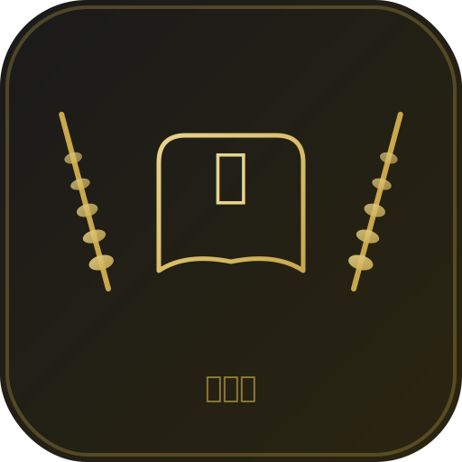

# 🌾 穗学伴 — 三年级下册数学自适应辅导课件

> 面向 iPad 的离线教学 Web App · 先教后测 · 动画引导 + 题库陪练



---

## 📖 项目简介

穗学伴是一个专为 iPad 设计的**离线 PWA 教学课件**，覆盖人教版三年级下册数学全部 9 章内容。特色是 **先教后测**——每章先用动画引导学生理解核心概念，再进行答题练习，实现真正的学习闭环。

### 核心流程

```
选章节 → 🎬 动画引导（分步教学 + 语音朗读）
       → ✏️ 答题练习（5道本章相关题）
       → 📊 结果反馈 + 错题自动收录
```

## 🎯 功能特性

| 特性 | 说明 |
|------|------|
| 🎬 **动画引导** | 9 章均有分步知识动画（方向罗盘 / 拳头记忆法 / 竖式分解 / 面积公式等） |
| 🔊 **语音朗读** | 亲切女声口语化讲解，每步配有自然旁白 |
| 📚 **完整题库** | 三年级下册 89 道题，覆盖口算/填空/选择/判断/笔算/应用 |
| 📕 **错题本** | 自动收录错题，按章节分组，一键重练，答对3次自动移除 |
| 📊 **学习统计** | 掌握度追踪、今日统计、连续打卡 |
| 📱 **iPad PWA** | 可添加到主屏幕，全屏离线运行 |
| 🔇 **完全离线** | Service Worker 缓存全部资源，无网络也能用 |

## 🗂️ 项目结构

```
app-src/
├── index.html            # 入口文件
├── manifest.json         # PWA 配置
├── sw.js                 # Service Worker（离线缓存）
├── css/
│   ├── theme.css         # 主题变量 + 全局样式
│   ├── layout.css        # 响应式布局
│   └── components.css    # 组件样式
├── js/
│   ├── app.js            # 应用主逻辑
│   ├── router.js         # Hash 路由
│   ├── store.js          # localStorage 持久化
│   ├── guide-data.js     # 9 章动画引导数据 + 语音旁白
│   ├── voice.js          # 语音朗读引擎（中文女声）
│   └── quiz-engine.js    # 出题引擎
├── data/
│   └── 三年级下册_题库.json  # 89 道题
└── assets/icons/
    ├── icon.svg          # 矢量图标
    ├── icon-180.png
    ├── icon-192.png
    └── icon-512.png
```

## 🚀 快速开始

### 本地运行

```bash
cd app-src
python3 -m http.server 8080
# 浏览器打开 http://localhost:8080
```

### 在 iPad 上安装

1. 确保电脑和 iPad 在同一网络
2. 电脑上启动 `python3 -m http.server 8080`
3. iPad Safari 打开 `http://<电脑IP>:8080`
4. 点底部分享按钮 → **添加到主屏幕**
5. 桌面图标打开 → 全屏离线运行 ✅

## 📚 章节内容

| 章 | 主题 | 题数 | 动画引导 |
|:--:|------|:----:|---------|
| 1 | 位置与方向 | 11 | 方向罗盘 + 面向关系 |
| 2 | 除数是一位数的除法 | 18 | 口算 + 笔算竖式 |
| 3 | 复式统计表 | 5 | 单表合并对比 |
| 4 | 两位数乘两位数 | 12 | 拆分法 + 竖式分步 |
| 5 | 面积 | 12 | 面积单位 + 公式推导 |
| 6 | 年、月、日 | 11 | 日历 + 拳头记忆法 + 口诀 + 平闰年 |
| 7 | 小数的初步认识 | 8 | 小数结构 + 比大小 |
| 8 | 数学广角—搭配 | 5 | 排列 + 搭配乘法 |
| 9 | 总复习 | 7 | 数与计算 + 空间与时间 |

## 🎨 设计规范

| 项目 | 值 |
|------|------|
| 主色 | `#C9A84C`（金色） |
| 背景 | `#1a1a1a`（深色） |
| 字体 | PingFang SC / Noto Sans SC |
| 布局 | iPad 竖屏优先，响应式适配 |
| 最小触控 | 44×44px（Apple HIG） |

## 🛠️ 技术栈

- **纯 HTML + CSS + JS** — 零依赖，零构建
- **Web Speech API** — 中文语音朗读
- **Canvas** — 图表绘制（家长看板 Stage 2）
- **localStorage** — 数据持久化
- **Service Worker** — 离线缓存
- **PWA** — 可安装到主屏幕

## 🧭 开发路线

| 阶段 | 状态 | 内容 |
|:----:|:----:|------|
| Stage 1 🟢 | **已完成** | 9章动画引导 + 题库 + 错题本 + PWA |
| Stage 2 ⏳ | 待开发 | 家长看板（雷达图 / 趋势图） |
| Stage 3 📋 | 待开发 | 更多年级题库 + 学习报告 |

## 📄 许可

MIT © 2026
